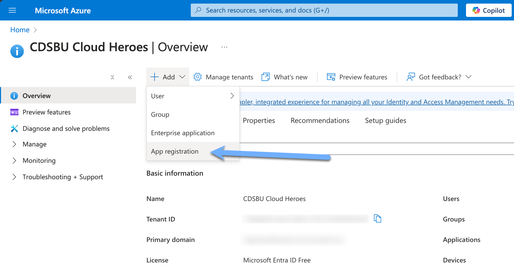

# NetApp Connector for M365 Copilot

## Introduction

The NetApp Connector for M365 Copilot is a containerized solution that enables you to connect any NetApp platform to Microsoft M365 Copilot without the need to migrate or rearchitect your existing data architecture.

> [!IMPORTANT]
> The NetApp Connector for M365 Copilot is currently in **Private Preview**. This means that the connector is not yet fully supported and may have some limitations. The connector requires a license to activate. You can request access to the connector by joining the Early Access Program (EAP). Please book a meeting with the following link to join the EAP: [Book a meeting with NetApp](https://outlook.office.com/bookwithme/user/d636d7a02ad8477c9af9a0cbb029af4d@netapp.com/meetingtype/nm-mXkp-TUO1CdzOmFfIBw2?anonymous&ismsaljsauthenabled&ep=mlink).

## Features

- **Containerized Deployment** - typical deployment time is less than 3 minutes
- **API Interface** - RESTful API for easy integration and management of the connector, replacing the need for M365 Search and Intelligence UI
- **Enhanced filtering** - filter data based on file type, size, and date
- **Parallelization** - multiple threads for faster data extraction, conversion and transfer
- **Large Document Chunking** - split large documents into smaller chunks for unlimited file ingestion into Microsoft Graph (MS Graph has a 3.8MB Content-Length limit, this feature allows for larger files to be ingested)
- **Offline Licensing** - no need to connect to the internet for licensing

## Getting Started

Want to get up and running quickly? Head over to the [User Quickstart](USER_QUICKSTART.md) guide for a step-by-step guide to deploying the connector and connecting your first share.

Note: If you are using a Kubernetes cluster, please see the [Helm Deployment](../charts/netapp-copilot-connector/README.md) document for more information. (Credit to @romdalf for the helm chart)

### Prerequisites

#### Network Requirements

- **Port 443** open for outbound traffic to the MS Graph API
- **Port 8080** open for internal management of the connector
- **Port 445** open for SMB file share access
- SMB File Share(s) must be routable to the connector

#### Software Requirements

- Microsoft 365 Copilot License
- Docker / Podman installed on the machine where the connector will be deployed
- Access to the offline tar image of the connector
- (Optional) Docker Compose installed on the machine where the connector will be deployed
- (Optional) Access to a Kubernetes cluster for deployment

### Register the connector in Azure Entra

In order for the connector to be able to securely communicate with M365 Copilot.



1. Navigate to the Azure Entra portal and select "Add" and select the "App Registration" option.
2. Fill in the required fields and click "Register". (No Redirect URI is required)
3. Copy the Application (client) ID and Directory (tenant) ID from the Overview page.
4. Navigate to the "API permissions" page and select "Add a permission".
5. Select "Microsoft Graph" and then "Application permissions".
6. Search for "ExternalConnection.ReadWrite.OwnedBy" and select the checkbox.
7. Search for "ExternalItem.ReadWrite.OwnedBy" and select the checkbox.
8. Search for "Directory.Read.All" and select the checkbox.
9. Search for "User.Read" and select the checkbox.
10. Click "Add permissions".
11. Click "Graph admin consent for (tenant)" and click "Yes".
12. Navigate to the "Certificates & secrets" page and click "New client secret".
13. Fill in the required fields and click "Add".
14. Copy the value of the client secret.

You have successfully registered the connector in Azure ENTRA. You will need the Application ID, Directory ID, and Client Secret for the next steps.

### Deploy the connector

The connector is deployed as a containerized solution. You can deploy the connector using Docker, Podman, or Kubernetes. The simplest way to deploy the connector is using Docker Compose, however enterprise customers may want to deploy the connector using Kubernetes for production deployments. Please refer to the [Helm Deployment](helm/README.md) document for more information.

#### Deploy using Docker Compose

1. Download the latest release and (optionally) the offline tar image of the connector from this repo. By default the release will reference the latest online package available on thie repo.
2. Configure the .env file with the required environment variables. The following environment variables are required:

```bash
# Required environment variables
MS_GRAPH_CLIENT_ID=<Application ID from Azure ENTRA>
MS_GRAPH_CLIENT_SECRET=<Client Secret from Azure ENTRA>
MS_GRAPH_TENANT_ID=<Directory ID from Azure ENTRA>
NETAPP_CONNECTOR_LICENSE=<License key for the connector> # Please see License section for more information
```

3. Run the following docker-compose command to deploy the connector:

```bash
docker-compose up -d
```

3. The connector will be deployed and will be accessible on port 8080. You can access the API documentation at `http://localhost:8080/docs`.

Trouble deploying the connector? Check the [Troubleshooting](#troubleshooting) section for common issues.

### Manage the connector

The connector is managed via API. The latest API documentation for your deployed connector can be found at `http://localhost:8080/docs` or `http://localhost:8080/redoc`

## Roadmap

Roadmap for the NetApp Connector for M365 Copilot is shared under an NDA. Please reach out to your NetApp representative for more information.

## Frequently Asked Questions (FAQ)

### What is the NetApp Connector for M365 Copilot?

The NetApp Connector for M365 Copilot is a containerized solution that enables you to connect any NetApp platform to Microsoft M365 Copilot without the need to migrate or rearchitect your existing data architecture. The connector is deployed as a containerized solution and provides an API interface for easy integration and management of the connector. The connector supports enhanced filtering, parallelization, and large document chunking.

### What are the supported sources for the NetApp Connector for M365 Copilot?

The NetApp Connector for M365 Copilot supports the following sources:

- SMB File Shares (v3.1.1 through v2.0). SMB 3.1.1 is recommended for optimal performance due to multi-channel support and performance improvements over prior SMB versions. This includes:
  - Azure NetApp Files (ANF)
  - AWS FSxN
  - Google Cloud Volumes NetApp (GCVN)
  - Cloud Volumes ONTAP (CVO)
  - Any ONTAP-based system (FAS, AFF, Select, etc.)

### What about non-NetApp sources?

The NetApp Connector for M365 Copilot is designed to work at protocol level and is not specifically locked to NetApp platforms. Please reach out to your NetApp representative for more information.

### How is the NetApp Connector for M365 Copilot licensed?

The NetApp Connector for M365 Copilot is licensed per licensed user of M365 Copilot. The license is perpetual and includes 1 year of support and maintenance. The license is tied to the connector and is not transferable. The license does not require an internet connection for activation.

### Does the NetApp Connector for M365 Copilot support multiple file shares?

Yes, the NetApp Connector for M365 Copilot supports multiple file shares. You can configure multiple file shares in the connector and manage them through the API interface. A shares API endpoint is available for managing and monitoring the file shares. Theoretically, there is no limit to the number of file shares that can be connected to the connector. In a real-world deployment, the number of file shares that can be connected to the connector is limited by the performance of the connector and the underlying storage system and as such should be tested in early testing before deploying to production.

### How do I upgrade the NetApp Connector for M365 Copilot?

Simply pull the latest image from the repository and redeploy the connector. The connector will automatically upgrade to the latest version. Please ensure that you have a valid license key for the connector.

### How does Microsoft 365 Copilot work for organizations with multiple regions?

All graph data is stored in the **Primary Provisioned Geography** location. This applies even if an organization has satellite regions, as explained here [Plan for Microsoft 365 Multi-Geo - Microsoft 365 Enterprise | Microsoft Learn](https://learn.microsoft.com/en-us/microsoft-365/enterprise/plan-for-multi-geo?view=o365-worldwide) but the graph index is only in the primary region (in order to provide a unified search experience across all the tenants).

## Troubleshooting

### The connnector starts, then stops immediately

This typically occurs when the connector does not have a valid license key. Ensure that the `NETAPP_CONNECTOR_LICENSE` environment variable is set in the .env file and that the license key is valid.

## Support

For any questions or issues, please open an issue in this repository.

## License

**Please note that use of this software is subject to the NetApp [General Terms](https://www.netapp.com/how-to-buy/sales-terms-and-conditions/terms-with-customers/general-terms/general-terms/).**
