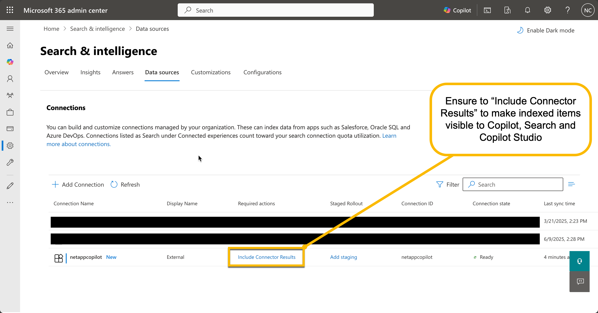

# NetApp Connector User Quick Start Guide

This guide assumes that you have deployed the NetApp connector and are ready to start using it. If you have not yet deployed the connector, please refer to the [NetApp Connector README](README.md).

## 1. Getting Started

> [!IMPORTANT]
> The NetApp Connector for M365 Copilot is currently in **Private Preview**. This means that the connector is not yet fully supported and may have some limitations. The connector requires a license to activate. You can request access to the connector by joining the Early Access Program (EAP). Please book a meeting with the following link to join the EAP: [Book a meeting with NetApp](https://outlook.office.com/bookwithme/user/d636d7a02ad8477c9af9a0cbb029af4d@netapp.com/meetingtype/nm-mXkp-TUO1CdzOmFfIBw2?anonymous&ismsaljsauthenabled&ep=mlink).

The easiest way to get started is by using the pre-built Docker image or [helm chart](../charts/netapp-copilot-connector/README.md). You can run the connector in a Docker container or deploy it to a Kubernetes cluster using Helm.

```bash
docker pull ghcr.io/netapp/netapp-copilot-connector:latest
```

or for a specific version:

```bash
docker pull ghcr.io/netapp/netapp-copilot-connector:2.7.0
```

Or you can import the tar file from the offline distribution package:

```bash
docker load -i netapp-connector.tar
```

### Running the Container

1. Download the [Sample .env file](./dist/.env.example) and rename it to `.env`.
2. Configure the `.env` file with the required environment variables. The following environment variables are required:

````bash
# NetApp Settings
NETAPP_CONNECTOR_LICENSE=your-licence-key-here # Mandatory

# Microsoft Graph configuration
MS_GRAPH_CLIENT_ID=your-client-id-here # Mandatory
MS_GRAPH_CLIENT_SECRET=your-client-secret-here # Mandatory
MS_GRAPH_TENANT_ID=your-tenant-id-here # Mandatory```
````

3. Download the latest docker-compose file from the [dist](./dist) directory.
4. Run the following docker-compose command to deploy the connector:

```bash
docker-compose up -d
```

> [!TIP]
> You can enable GPU support by uncommenting the `deploy` section in the `docker-compose.yml` file. This will allow the connector to leverage GPU acceleration for faster data extraction and conversion. Make sure you have the NVIDIA Container Toolkit installed on your host machine.

### Using Helm

If you are using Kubernetes, you can deploy the connector using Helm. Please refer to the [Helm Deployment](helm/README.md) document for more information.

## 2. Adding your first share

> [!IMPORTANT]
> A dedicated stand-alone desktop UI is available for Windows, MacOS and Linux: [Download the Desktop App](./client).

## 3. Viewing the results in Microsoft 365 Copilot

> [!WARNING]
> You must perform this step after you have added your first share and the connector is running in order to see the results in Microsoft 365 Copilot.

Once the connector is running and you have added your first share, you can start using it with Microsoft 365 Copilot. The connector will automatically index the files in the configured shares and make them available for Copilot to use. Please visit the [Search and Intelligence](https://admin.microsoft.com/Adminportal/Home?source=applauncher#/MicrosoftSearch/connectors) section of the Microsoft 365 Admin Center and ensure that you have selected **_Include Connector Results_** for the NetApp Connector. This will allow Copilot to access the indexed files.



## 4. (Advanced) Using the API and creating an admin user

The API documentation is available at `http://YourConnectorIP:8000/docs` after starting the connector. Please refer to our [API User Guide](./USER_API_GUIDE.md) for more details on how to use the API.

If you have any feedback or questions regarding the NetApp Connector or its Documentation, please reach out to us open a GitHub issue at [NetApp Innovation Labs](https://github.com/NetApp/Innovation-Labs/issues).
